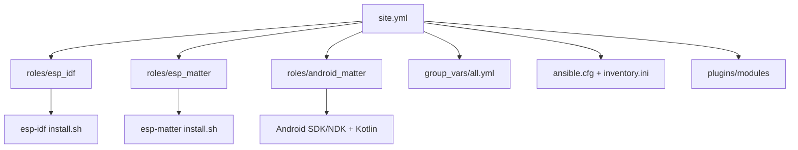

# Ansible ESP-IDF / ESP-Matter / Android Matter Setup

This repo provisions ESP-IDF, ESP-Matter, and Android build prerequisites (Linux). It is structured for easy extension with roles and custom modules.



## Structure

- `site.yml`: main playbook
- `roles/`: role implementations
- `group_vars/all.yml`: shared defaults
- `plugins/modules/`: custom modules (optional)
- `ansible.cfg`: local config
- `inventory.ini`: local inventory (localhost)

## Usage

Run with the default inventory:

```bash
ansible-playbook site.yml
```

## ESP-Matter Role

The `roles/esp_matter` role installs ESP-Matter from the specified ref and initializes submodules.

Minimal example:

```yaml
- name: Install ESP-Matter only
  hosts: all
  vars:
    esp_install_dir_expanded: "~/.esp"
  roles:
    - role: esp_matter
```

Override variables as needed:

```bash
ansible-playbook site.yml \
  -e esp_idf_version=v5.5.2 \
  -e esp_matter_ref=main \
  -e 'esp_idf_targets=["esp32","esp32s3"]'
```

## Key Variables

- `esp_install_dir` (prompted, default `~/.esp`)
- `esp_idf_version`
- `esp_idf_targets`
- `esp_idf_tools_path`
- `esp_matter_ref`
- `android_matter_setup_enabled`
- `android_matter_sdk_root`
- `android_matter_ndk_version`
- `android_matter_sdk_api_level`
- `android_matter_cmdline_tools_version`
- `android_matter_kotlin_version`
- `preflight_min_disk_mb`
- `preflight_min_mem_mb`
- `preflight_allow_overwrite`
- `preflight_skip_network`
- `preflight_check_urls`

See `group_vars/all.yml` for defaults.

## Linting And Prek (uv)

Create a virtual environment and install dev tools:

```bash
uv venv
uv sync --extra dev
```

Run linters:

```bash
yamllint .
ansible-lint
```

Enable prek:

```bash
prek install
prek run --all-files
```

## Nix Dev Shell

If you use Nix, you can enter a fully provisioned dev shell:

```bash
nix develop
```

This provides `ansible`, `ansible-lint`, `yamllint`, `prek`, `uv`, and `python3`.

## Extending

- Add new roles under `roles/`
- Add custom modules under `plugins/modules/`
- Update `site.yml` to include new roles

## Notes

- Android SDK Command Line Tools must already be installed under `{{ android_matter_sdk_root }}` for the Android role to proceed.
